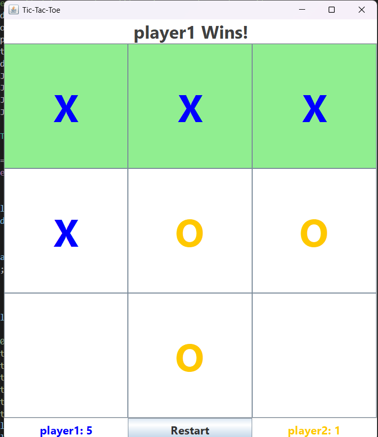
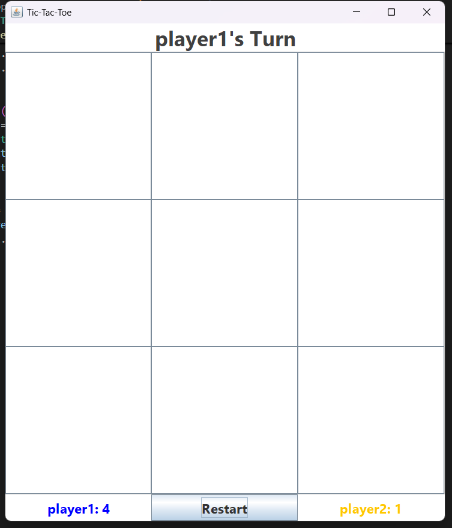

# 🎮 TicTacToe - Java Swing Game

A desktop-based **2-player Tic-Tac-Toe game** built using **Java Swing**, featuring:

- Player name entry
- Dynamic score tracking
- Engaging UI with turn indication
- Restart support and win/draw detection

---

## 🖥️ Features

✅ Real-time 2-player gameplay  
✅ GUI built with Java AWT & Swing  
✅ Highlighted win/tie feedback  
✅ Scoreboard to track wins  
✅ Restart option for multiple matches  

---

## 📸 Screenshots

> 
> Example:
> 

---

## 🚀 How to Run
  ```bash
  javac TicTacToe.java
  java TicTacToe
  ```

### 🔧 Prerequisites:
- Java JDK 8 or above

### 🛠️ Steps:

1. **Clone the repo**
   ```bash
   git clone https://github.com/Madhansingh23/TicTacToe.git
   cd TicTacToe
